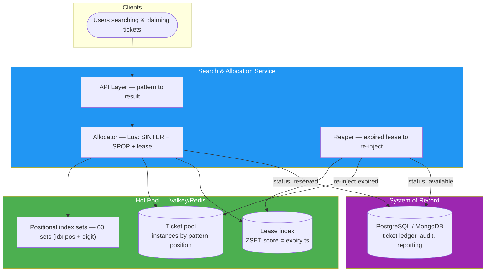
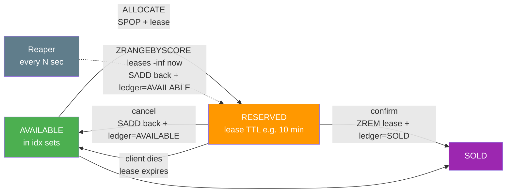

# Solution Proposal — Lottery Ticket Search & Allocation System

> **Project:** SS-INT-002 | **Version:** 1.0 | **Status:** Draft
> Design exercise: no code implementation, per challenge.

## 1. Purpose & Scope

Design a production system that:

1. Stores **10M lottery tickets** (6-digit numbers).
2. Answers **wildcard pattern searches** (`****23`, `1****5`, `123***`) fast.
3. **Allocates** matching tickets to users such that the **same ticket is never handed to two users simultaneously**.

In scope: storage, indexing, matching algorithm, allocation/concurrency mechanism, failure recovery, performance analysis. Out of scope: payment, fraud, regulatory, UI.

## 2. Problem Analysis

### 2.1 Domain cardinality — the insight that shapes everything

| Fact | Value | Consequence |
|------|-------|-------------|
| Distinct 6-digit numbers | **1,000,000** (000000–999999) | A 10M-ticket dataset holds **~10 instances of each number** — allocation unit must be the ticket *instance* (`number + serial`), never the number |
| Distinct wildcard patterns | 11⁶ = **1,771,561** | Pattern space is small but materializing per-pattern sets costs 10M × 64 = 640M memberships — wasteful (§6) |

This is the first thing an interviewer should hear: we noticed the dataset is "10M instances of a 1M-value domain," which drives both the data model and the allocation semantics.

### 2.2 Constraint decomposition

"Same pattern must not return the same ticket to multiple users **at the same time**" decomposes into:

1. **Allocation atomicity** — a ticket claimed by user A must be invisible to user B from that instant.
2. **Time-bounded exclusivity** — "at the same time" implies allocation is a *reservation* with a lease, not a permanent burn (otherwise a crashed client would destroy inventory).
3. **Recovery** — reservations abandoned by crashed clients must return to the pool.

### 2.3 Query shapes

Every pattern is 6 chars over {digit, `*`}. A pattern with `k` specified digits selects tickets by `k` positional constraints. This means **any** pattern — prefix, suffix, interior, scattered — is a conjunction of ≤6 positional predicates. One index design can serve all shapes uniformly.

## 3. Solution Overview



**Two-tier storage.** The hot pool (Redis/Valkey) owns matching + allocation — the only place that must be fast and atomic. The system of record (PostgreSQL or MongoDB) owns durable truth — ticket lifecycle, audit, analytics. The pool is rebuildable from the ledger.

## 4. Data Model & Data Structures

### 4.1 Ledger (system of record)

```
ticket_id        — unique instance id: "<number>-<serial>"  (e.g. "123456-0007")
number           — CHAR(6), indexed
serial           — SMALLINT (copy number within the number group)
status           — AVAILABLE | RESERVED | SOLD | VOID
reserved_by      — request id / user id (nullable)
reserved_at      — timestamptz (nullable)
sold_at          — timestamptz (nullable)
```

Indexes: unique (`ticket_id`), (`number`), (`status`, `reserved_at`) for the reaper and ops queries.

### 4.2 Hot pool (Redis/Valkey) — four structures

| Structure | Key | Member / score | Size | Purpose |
|-----------|-----|----------------|------|---------|
| Availability pool | `pool` | ticket_id (10M members) | 10M | global "still available" set (optional bulk source) |
| Positional index | `idx:pos{0..5}:{0..9}` | ticket_id | 60M memberships (each ticket in 6 sets) | wildcard matching |
| Lease index | `leases` (ZSET) | member=ticket_id, score=expiry unix ts | ≤ concurrent reservations | reaper input |
| Pending per request | `pending:{requestID}` (LIST) | ticket_ids popped for this request | transient, TTL'd | confirm/release in one shot |

Optional fast paths for the two most common shapes: `prefix:{p}` / `suffix:{s}` sets for `123***` and `****23`-style patterns → O(1) lookup, no intersection (see ADR-02 note; not built first — the 60-set design already serves them at acceptable cost).

### 4.3 Ticket identity

ticket_id = `<6-digit number>-<serial>` (serial = 0..~9 given 10M/1M ≈ 10 copies). Strings, ~10–12 bytes. Compact, human-debuggable, stable across tiers.

## 5. Storage & Technology Choice

### 5.1 Recommendation

**Valkey/Redis as the primary matching + allocation engine; PostgreSQL (or MongoDB) as the system of record.**

| Criterion | Why Redis wins here |
|-----------|---------------------|
| Query performance | In-memory set operations (`SINTER`, `SPOP`) at ~1M members/op in tens of ms |
| Concurrency | **Single-threaded command execution linearizes `SPOP`** — atomic allocation without any locking protocol |
| Fit for data | 10M small strings + 60M set memberships ≈ 2–2.5 GB — trivially one instance (or 2–4 shards) |
| Ops simplicity | One binary; AOF + replica for durability; mature client libs |
| Real-world precedent | Inventory/seat/lottery pools on Redis are a standard, battle-tested pattern |

Why **not** Redis-only: it is memory-bound and not the audit-grade durable store for a 10M-ticket asset ledger — hence the two-tier split. The ledger needs ACID history (sales, refunds, disputes, reporting), which PostgreSQL/MongoDB provide; the pool is derived data, rebuildable from the ledger at any time.

### 5.2 Alternatives considered (honest trade-offs)

| Option | Wildcard matching | Atomic allocation | Verdict |
|--------|-------------------|-------------------|---------|
| **PostgreSQL only** (`LIKE` + `FOR UPDATE SKIP LOCKED`) | `number LIKE '1____5'`; prefix via btree, suffix via reversed column index; interior patterns degrade to seq-scan/bitmap | `SKIP LOCKED` gives lock-free claim semantics — correct and simple | **Strong runner-up.** Choose if ops must run one database. At 10M rows: ~50–200 ms/claim, contention on hot patterns, index gymnastics for arbitrary wildcards |
| **MongoDB only** (`$regex` + claim doc) | Regex over 6-char field; index helps only anchored patterns | `findOneAndUpdate` claim state — atomic per doc but "first unclaimed match" needs index on (pattern-matchable, status) — awkward for interior wildcards | Viable; weaker fit than Redis for both matching and claim |
| **Elasticsearch** | Wildcard queries excellent | Claim via versioned doc update — distributed, more moving parts | Overkill at 10M rows |
| **Per-pattern materialization** (all 1.77M pattern sets in Redis) | O(1) per pattern | `SPOP` per pattern set | 640M memberships ≈ 13 GB+ RAM — rejected (ADR-02) |

## 6. Matching Algorithm & Indexing Strategy

### 6.1 Positional digit-set indexing

For each position `i ∈ 0..5` and digit `d ∈ 0..9`, maintain `idx:pos{i}:d` = set of ticket_ids whose i-th digit is `d`.

- Build cost: one scan of the 10M tickets → 6 SADD-equivalents per ticket.
- Memory: 60 sets × 1M members ≈ 60M memberships (each ticket_id ~10–12 bytes + set overhead ⇒ ≈ 1.5–2 GB worst case; intset/hash encoding optimizes further).

### 6.2 Query plan for pattern P (k specified digits)

```
1. sets = [ idx:pos{i}:P[i] for each specified position i ]
2. SINTERSTORE tmp:{requestID} sets...     # materialize matches (~min set size)
3. SPOP tmp:{requestID}                    # allocate ONE ticket atomically
4. DEL tmp:{requestID}
```

- Complexity: O(k × min set size) ≈ O(10⁶) worst case → **~10–50 ms** in Redis; k=0 (`******`) → SPOP on `pool` directly, O(1).
- Correctness: SINTER only over specified positions — wildcards contribute nothing, exactly matching the pattern semantics.
- Optional fast paths (`prefix:`/`suffix:` sets) reduce the two README examples to O(1) — noted as an optimization, not required.

### 6.3 Allocation as one Lua script (atomicity)

```lua
-- ALLOCATE(pattern_positions, requestID, leaseSecs)
local sets = {}
for _, key in ipairs(KEYS) do ... SINTERSTORE tmp ... end   -- KEYS = idx sets
local ticket = redis.call('SPOP', tmp)
if ticket then
  redis.call('ZADD', 'leases', now + leaseSecs, ticket)
  redis.call('LPUSH', 'pending:' .. requestID, ticket)
  redis.call('EXPIRE', 'pending:' .. requestID, leaseSecs + grace)
end
return ticket
```

One script = one atomic step: intersect → pop → lease → stage. **No lock is ever taken by the application** — the server's single-threaded execution of the script *is* the mutual exclusion (ADR-03).

## 7. Concurrency & Distribution Strategy

### 7.1 Why duplicates cannot happen

- `SPOP` removes-and-returns in one atomic server operation. A ticket is in exactly one set position at a time; once popped, no subsequent call (any thread, any host) can observe or pop it again.
- The Lua script makes the *entire* claim (intersect + pop + lease) atomic, closing the window between "found a match" and "marked it taken" that naive check-then-claim designs have.
- Two concurrent identical-pattern requests: Redis serializes the two scripts; each pops a **different** member of the intersection. Result: distinct tickets, zero coordination overhead, no deadlocks (there is nothing to lock).

### 7.2 Reservation lifecycle (time-bounded exclusivity)



- **Lease:** `leases` ZSET scored by expiry timestamp — reservation is time-bounded ("at the same time" honored, crashes self-heal).
- **Reaper:** a lightweight loop (or cron) re-injects expired reservations: SADD back to all 6 positional sets + ledger status → AVAILABLE. Idempotent: re-adding a ticket already present is a no-op.
- **Confirm/cancel:** app removes the lease and updates the ledger; pending list per request makes multi-ticket checkout atomic to reason about.

### 7.3 Scaling beyond one instance

- One instance: 100K+ SPOPs/sec, queries in tens of ms — far beyond the challenge scale.
- When needed: **shard the pool by ticket_id hash** across 2–4 instances. Each ticket lives in exactly one shard ⇒ per-shard SPOP still guarantees global uniqueness. Pattern queries become scatter-gather: intersect per shard (or use a coordinator shard for intersections, then pop on the shard owning the candidate).
- No cross-shard transactions needed for correctness of the no-duplicate property — uniqueness is per-ticket, and a ticket has exactly one home shard.

## 8. Performance Analysis

| Dimension | Estimate | Method / rationale |
|-----------|----------|-------------------|
| Memory (pool) | ~2–2.5 GB total | 10M pool members (~350 MB) + 60M index memberships (~1.9 GB worst case); fits one 4 GB instance, or 2 shards × 2 GB |
| Query latency | p50 < 5 ms, p95 < 50 ms | `SINTER` ≤6 sets of ≤1M members; prefix/suffix fast paths O(1); `SPOP` O(1) |
| Allocation throughput | ≥100K allocations/s | Redis single-core set ops; linear scaling with shards |
| Ledger write path | async, off hot path | reservation confirmed → status update; ledger never on the search path |
| Rebuild time (disaster) | minutes | pool rebuilt from ledger: one scan, 6 SADDs per ticket |

Trade-offs accepted: RAM cost vs. relational simplicity; eventual consistency between pool and ledger (lease state is authoritative in the pool, ledger is the durable mirror); single Redis core per shard (no intra-query parallelism — irrelevant at this scale).

## 9. Failure Modes & Recovery

| Failure | Effect | Recovery |
|---------|--------|----------|
| Client crashes after allocation | Ticket sits RESERVED with lease | Reaper re-injects after TTL — no permanent inventory loss |
| Redis process dies (AOF everysec) | ≤1 s of pool mutations lost | Rebuild pool from ledger; unconfirmed leases naturally reset |
| Ledger DB down | Search/allocation still works (pool is hot truth) | Reservations continue; confirmations queue/retry — pool is the availability authority |
| Reaper dies | Reservations age out late | Lease TTLs still bound exclusivity; restart reaper, catch-up pass |
| Shard failure | 1/N of pool unavailable | Rebuild that shard from ledger partition; hash-routing keeps keys stable |

## 10. Assumptions & Interpretations

| # | Assumption |
|---|-----------|
| 1 | 6-digit numbers range 000000–999999 ⇒ duplicates in a 10M dataset are expected ⇒ allocation unit is the ticket instance |
| 2 | "Same ticket at the same time" = overlapping reservation windows ⇒ allocation is a TTL'd reservation, not permanent removal |
| 3 | Allocation means "reserved for a user", confirmable within the lease; sold only on confirm |
| 4 | Pattern is always exactly 6 chars (digits + `*`), `*` matches exactly one position (not a run) |
| 5 | Read-your-own consistency is sufficient; no multi-key ACID transactions across pool + ledger |
| 6 | 10M tickets are loaded/refreshed in batch (draw-based), not per-ticket mutable data |

## 11. Open Questions (for reviewer discussion)

1. Should allocation return **one** ticket per request or a **batch** (e.g., N tickets)? (Design supports both; batch = Lua loop with N SPOPs.)
2. Lease TTL sizing per business flow (10 min assumed).
3. Whether "sold" vs "allocated" are the same thing in the interviewer's domain model.

---

> **Related:** [[000_proposal_index]], [[02_architecture_decision_records]]
