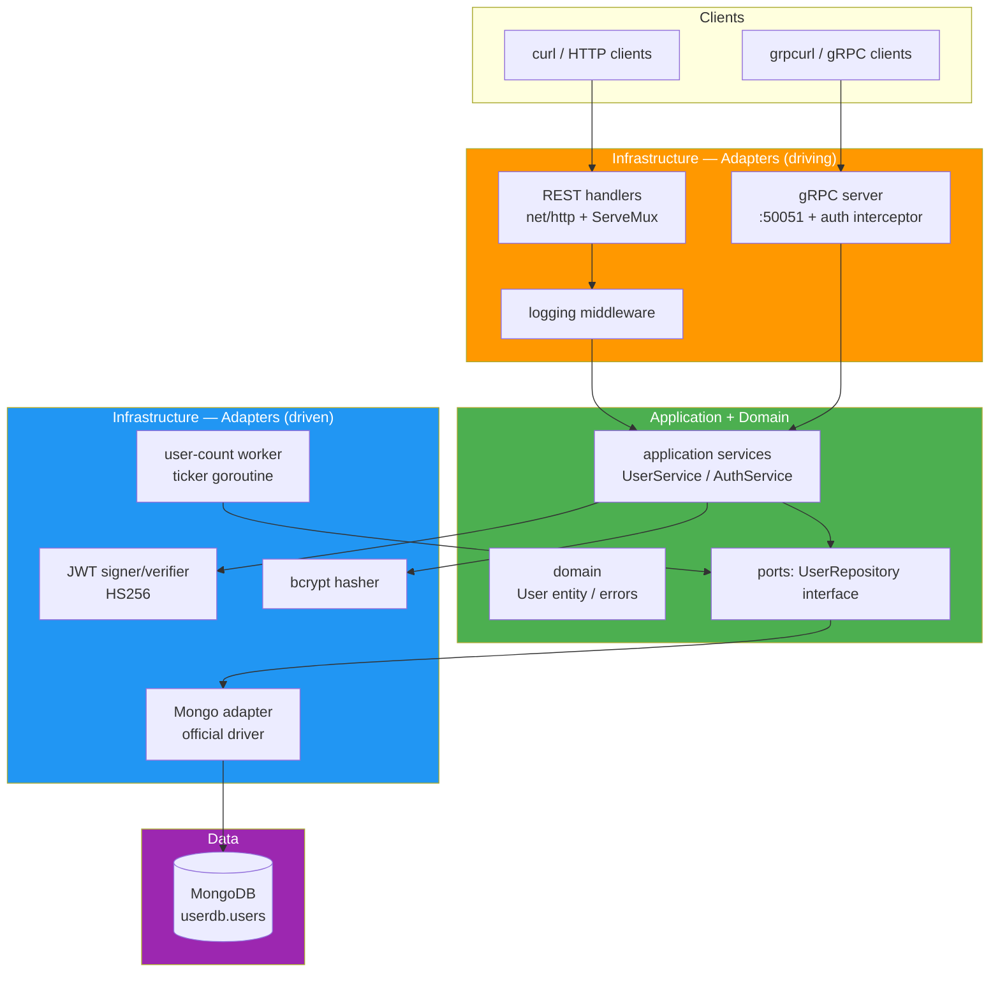

# Software Architecture Document — User Management API

> **Project:** SS-INT-001 | **Version:** 1.0 | **Status:** Draft

## 1. Architectural Style

| Aspect | Choice | Rationale |
|--------|-------|-----------|
| Overall style | **Hexagonal (ports & adapters)**, single deployable | Named bonus item; clean separation of domain/application/infrastructure |
| Communication | REST (HTTP/1.1 JSON) + gRPC (HTTP/2 protobuf) — two adapters, one core | REST required; gRPC bonus; shared core proves the pattern's payoff |
| Persistence | MongoDB behind a repository **port** (interface) | Challenge requirement + bonus abstraction; enables fakes in tests |
| Router | stdlib `net/http` `ServeMux` (Go 1.22+ method+wildcard routing) | Idiomatic, zero-dep, reviewer-friendly |
| Config | env vars, fail-fast validation at startup | 12-factor; no config framework |
| Logging | stdlib `log/slog` (JSON handler) | Structured, zero-dep |
| Deployment | Multi-stage Dockerfile + docker-compose (API + Mongo) | Bonus item; zero-friction review |

## 2. High-Level Architecture



**Dependency rule:** domain → nothing external (stdlib only). application → domain + ports. infrastructure → domain (implements ports) + application (driving adapters call services). Main wires everything (composition root).

## 3. Package Structure

```
7-solution-interview/
├── cmd/api/main.go              # composition root: config, wiring, servers, worker, shutdown
├── internal/
│   ├── domain/
│   │   ├── user.go              # User entity, UserStatus-free (simple struct)
│   │   └── errors.go            # ErrNotFound, ErrEmailExists, ErrInvalidCredentials, ErrValidation
│   ├── application/
│   │   ├── user_service.go      # Register/Create/Get/List/Update/Delete use cases
│   │   ├── auth_service.go      # Login (verify + issue), TokenVerify (shared REST+gRPC)
│   │   └── ports.go             # UserRepository port + PasswordHasher + TokenManager ports
│   ├── infrastructure/
│   │   ├── mongodb/user_repo.go # adapter: implements ports.UserRepository
│   │   ├── auth/bcrypt.go       # PasswordHasher adapter
│   │   ├── auth/jwt.go          # TokenManager adapter (HS256)
│   │   ├── httpapi/             # REST adapter: router.go, handlers, middleware.go, dto.go
│   │   ├── grpcapi/             # gRPC adapter: server.go, interceptor.go
│   │   └── logger/logger.go     # slog JSON setup
│   └── worker/usercount.go      # 10s count logger (FR-009)
├── proto/user_service/v1/user_service.proto
├── gen/userservice/v1/          # protoc-generated code (make gen-proto)
├── testutil/fake_repo.go        # in-memory UserRepository fake (hand-written, no mock lib)
├── Dockerfile                   # multi-stage
├── docker-compose.yml           # api + mongo:8 + healthchecks + volume
├── Makefile                     # build, run, test, cover, gen-proto, docker-up
├── go.mod
└── README.md                    # from 031
```

## 4. Component Design

| Component | Responsibility | Key interfaces |
|-----------|---------------|----------------|
| `domain.User` | Plain struct `{ID, Name, Email, CreatedAt}` + `NewUser` constructor (applies validation rules) | — |
| `ports.UserRepository` | `Create, FindByID, FindByEmail, ListAll, Update, Delete, Count` | implemented by Mongo adapter AND fake |
| `ports.TokenManager` | `Issue(user) (token, exp, err)` / `Verify(token) (claims, err)` | JWT adapter |
| `ports.PasswordHasher` | `Hash(pw) (string, err)` / `Compare(hash, pw) error` | bcrypt adapter |
| `application.UserService` | orchestrates use cases, maps domain errors → API-agnostic errors | depends only on ports |
| `application.AuthService` | login flow, token issuance, shared token verification | used by REST middleware AND gRPC interceptor |
| `httpapi.Router` | `ServeMux`, route registration, middleware chain, JSON decode/encode, error envelope | calls UserService/AuthService |
| `grpcapi.Server` | implements `UserServiceServer`, unary interceptor → AuthService.Verify | same core |
| `worker.UserCountWorker` | `Run(ctx, interval, repo, logger)` — ticker loop, exits on ctx cancel | interval injectable (AC-009c) |
| `cmd/api/main` | env config + validation, Mongo connect + index ensure, wiring, both servers, worker, graceful shutdown | — |

## 5. Request Flows

**REST login:** middleware(log) → handler decode → AuthService.Login → repo.FindByEmail → bcrypt.Compare → jwt.Issue → envelope.

**gRPC CreateUser:** interceptor (JWT from metadata → AuthService.Verify) → server.CreateUser → UserService.Create → repo.Create → proto User.

**Worker:** main starts `worker.Run` with shutdown ctx → ticker(10s) → repo.Count → slog `total_users=N`.

## 6. Security Architecture

| Control | Implementation |
|---------|---------------|
| AuthN | JWT HS256; middleware + interceptor share one verifier; `alg` pinned to HS256 |
| Secret handling | env-only; fail-fast ≥32 bytes; never logged |
| Passwords | bcrypt cost 10; hash never leaves domain→adapter boundary; never in API responses |
| Input validation | whitelist-based in `domain.NewUser` + DTO layer; JSON unknown-field rejection |
| Request limits | `http.MaxBytesReader` 1 MB |
| Error hygiene | generic 500s; no stack traces or driver errors leaked to clients |
| Known limitation (documented) | No role model — any authenticated caller may update/delete any user (A8); production hardening: ownership/roles |

## 7. Concurrency Design

| Concern | Design |
|---------|--------|
| Worker lifecycle | single goroutine owned by main; ctx-cancelled by graceful shutdown; no leaks (verified via `-race` + tests) |
| Duplicate email | friendly pre-check + unique index as race-proof backstop (R-04) |
| Graceful shutdown | `signal.NotifyContext` → HTTP `Shutdown(ctx)` → gRPC `GracefulStop()` → worker cancel → exit 0 |

## 8. Quality Attributes

| Attribute | Scenario | Response |
|-----------|---------|----------|
| Testability | unit tests w/o Mongo | repository port + hand-written fake (041) |
| Maintainability | reviewer reads code cold | 4 clean layers, no framework magic, small files |
| Security | OWASP-lite | JWT checks, bcrypt, validation, no leaks |
| Operability | compose up → ready | healthchecks, structured logs, graceful shutdown |
| Performance | 10M-scale? (N/A here) | single-node demo; Mongo indexes on `_id`/`email` are the relevant story |

## 9. Architecture Decisions

| # | Decision | Rationale |
|---|----------|-----------|
| ADR-01 | Hexagonal layout | bonus item + testability + demonstrates senior-level structure |
| ADR-02 | stdlib router | idiomatic, minimal deps, Go 1.22+ mux is sufficient |
| ADR-03 | Repository port + fake (no mock library) | challenge says "mock where appropriate" — interfaces make it clean without dep |
| ADR-04 | One application core, REST + gRPC adapters | proves hexagonal payoff; avoids duplicated logic |
| ADR-05 | bcrypt + HS256 | industry defaults for the stated requirements |
| ADR-06 | Programmatic unique-index creation | idempotent, env-agnostic (A12) |
| ADR-07 | No ORM/ODM | official driver is required & idiomatic |

---

> **Related:** [[022_API_specification]], [[023_database_schema_DDL]], [[041_test_plan]]
